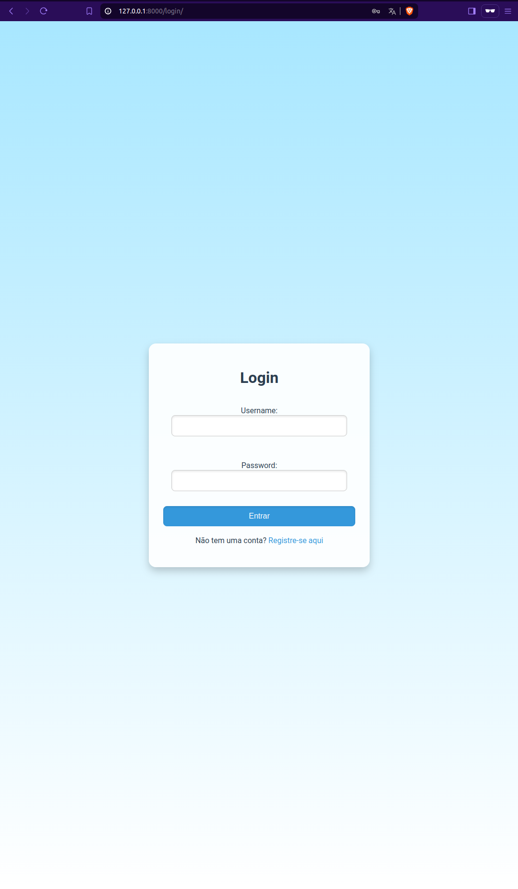
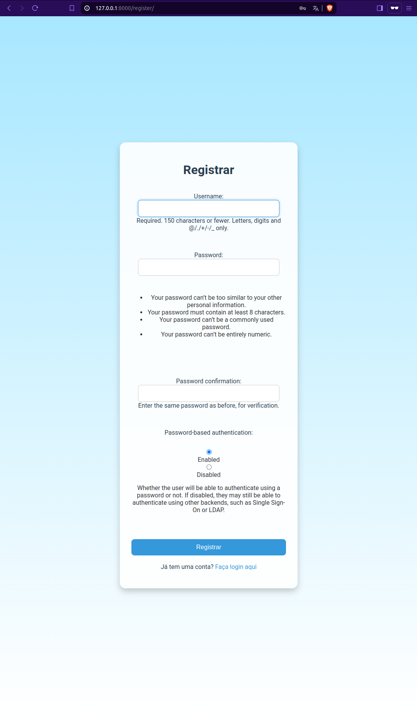
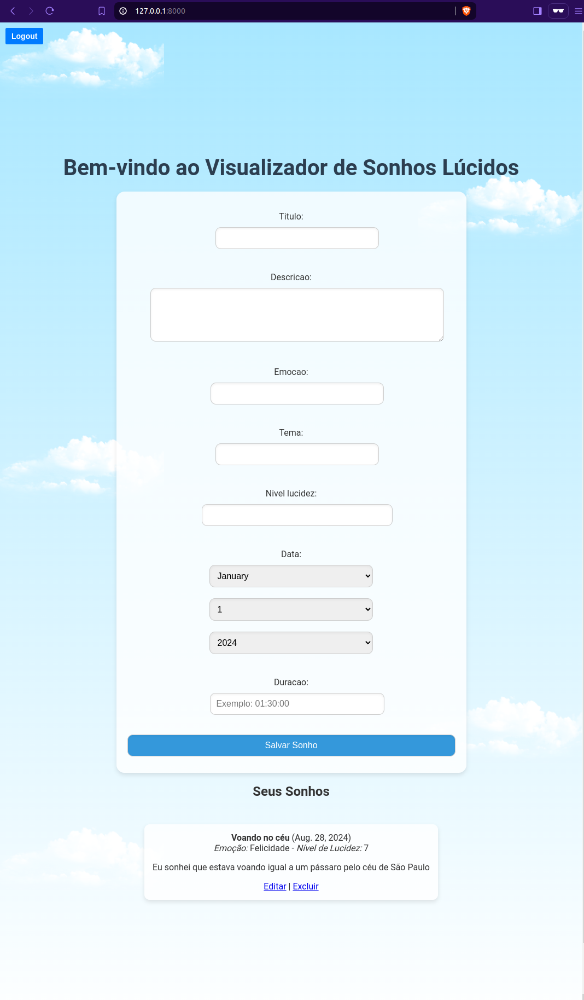
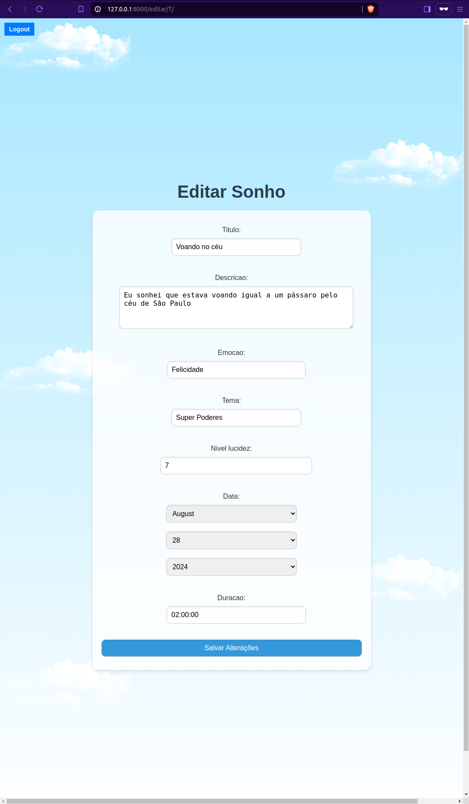
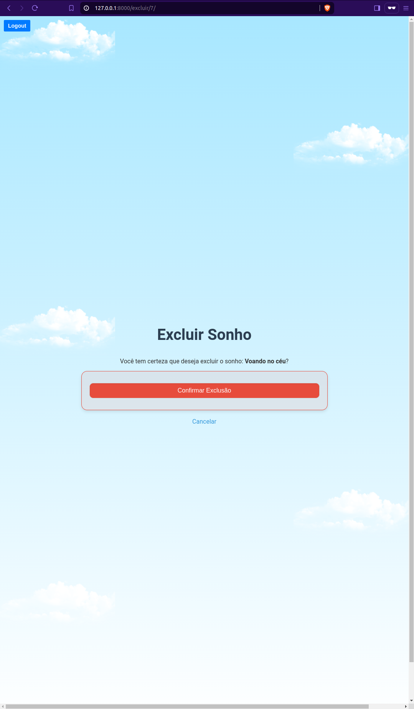

# Projeto Sonhos Lúcidos

## Descrição

**"Sonhos Lúcidos"** é uma aplicação web desenvolvida com Django que permite aos usuários registrar, editar, e excluir seus sonhos lúcidos. A aplicação é protegida por autenticação, garantindo que apenas usuários registrados possam acessar e gerenciar seus próprios sonhos. A interface é simples e intuitiva, com um design moderno e responsivo.

## Funcionalidades

- **Registro de Sonhos:** Adicione novos sonhos ao sistema com detalhes específicos.
- **Edição de Sonhos:** Altere informações dos sonhos já registrados.
- **Exclusão de Sonhos:** Remova sonhos do sistema conforme necessário.
- **Autenticação de Usuários:** Sistema de login e logout para garantir que somente usuários autenticados tenham acesso.
- **Botão de Logout:** Acesso fácil para desconectar, fixo no canto superior esquerdo da aplicação.

## Estrutura de Pastas

```plaintext
sonhos_lucidos/
│
├── core/                   # Aplicativo principal
│   ├── migrations/         # Arquivos de migração do banco de dados
│   ├── static/             # Arquivos estáticos (CSS, JS, imagens)
│   ├── templates/          # Templates HTML
│   ├── admin.py            # Configurações do admin do Django
│   ├── apps.py             # Configurações do app
│   ├── models.py           # Definições de modelos do banco de dados
│   ├── views.py            # Lógica das views
│   └── urls.py             # Definições de rotas do app
│
├── media/                  # Diretório para uploads de mídia
├── static/                 # Diretório para arquivos estáticos coletados
├── templates/              # Diretório para templates base
│
├── manage.py               # Script de gerenciamento do Django
└── README.md               # Documentação do projeto
```

## Como Rodar o Projeto
### Pré-requisitos

- Python 3.10 ou superior
- Django 5.1

### Passos para Rodar
1. Clone o repositório:

    ```
    git clone https://github.com/seu-usuario/sonhos-lucidos.git
    cd sonhos_lucidos
    ```

2. Configure o ambiente virtual (opcional):

    ```
    python3 -m venv venv
    source venv/bin/activate  # No Windows use: venv\Scripts\activate
    ```

3. Instale o Django:

    ```
    pip install django
    ```

4. Aplique as migrações do banco de dados:

    ```
    python manage.py makemigrations
    python manage.py migrate
    ```

5. Inicie o servidor de desenvolvimento:

    ```
    python manage.py runserver
    ```

6. Acesse a aplicação no navegador:

    - Abra o navegador e acesse http://127.0.0.1:8000/.

## Uso
- **Registrar:** Crie uma conta na página de registro.
- **Login:** Faça login usando suas credenciais.
- **Adicionar Sonhos:** Após o login, adicione, edite e exclua sonhos conforme desejado.
- **Logout:** Use o botão de logout fixo no canto superior esquerdo para sair da aplicação.

## Screenshots

Aqui estão algumas capturas de tela da aplicação para ilustrar como ela se parece em uso.

### Tela de Login


### Tela de Registro


### Tela Inicial


### Tela de Edição de Sonho


### Tela de Exclusão de Sonho
